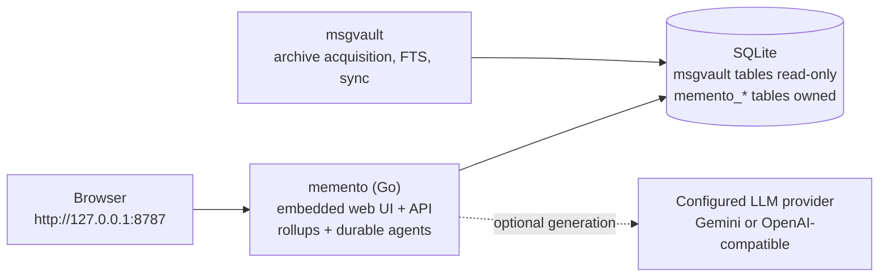

# Memento

Memento turns years of email into source-attributed living documents. It is a
local-first knowledge layer over a [`msgvault`](https://www.msgvault.io/) email
archive, built for the long-term signal that ordinary inboxes and keyword
search leave buried. Memento is not an email client and does not rebuild your
inbox. It organizes long-term email history into memory surfaces:

- **People**: relationship wikis for meaningful contacts.
- **Projects**: bounded narratives for user-confirmed work or life projects.
- **Newsletters**: coverage summaries, recurring themes, and recent items.
- **Concepts**: user-declared evergreen topics backed by archive sources.
- **Home**: an overview plus "Ask Memento" chat across your archive.

Memento depends on [`kenn-io/msgvault`](https://github.com/kenn-io/msgvault)
for mail acquisition, archive storage, full-text search, semantic/vector
search, and sync.

[](https://www.youtube.com/watch?v=Ms1KeAYCN2A)

Watch the demo: <https://www.youtube.com/watch?v=Ms1KeAYCN2A>

## What Makes It Different

Memento combines deterministic extraction with agents that know where to look.

- Deterministic extraction runs before LLM calls: canonical contacts, email
  aliases, newsletter sources, communication rollups, and social context are
  derived from the archive first.
- Each dimension has its own agent workflow and prompt. Project, Concept,
  Person, and Home / Ask Memento workflows search for different evidence because
  they are building different memory surfaces.
- Agents use purpose-built tools: full-text search for exact terms, vector
  search for semantic recall, compact message batches for evidence, thread
  summaries for long chains, social graph navigation for relationship context,
  gap detection for missing evidence, and context-status tools before broad
  expansion.
- User edits and notes become future context. A corrected narrative section or
  personal note makes later agent runs more accurate instead of being overwritten
  by the next generation pass.
- Generated factual claims are designed to trace back to source messages rather
  than standing alone as unsourced summaries.

## How It Works

Memento runs locally as a single Go process. The binary embeds the statically
built web UI and serves it together with the API on one localhost origin,
reading your `msgvault` archive while writing only Memento-owned tables. No
Node.js is needed at runtime — only for building or developing the frontend.



Key design choices:

- One binary, one origin: the Go server hosts both the UI and the API, bound
  to `127.0.0.1` only.
- `msgvault` data is treated as read-only; Memento writes to `memento_*` tables.
- Dimension indexes read materialized rollup tables for fast page loads.
- Retrieval uses msgvault search: hybrid by default where available, FTS as the
  reliable fallback, and vector search for semantic agent recall.
- Browser avatar traffic stays local: the UI requests `/api/avatar/{hash}`;
  the backend may fetch Gravatar only for known local contacts or the configured
  owner email, and caches both found and missing avatars in SQLite.
- Deterministic extraction runs before LLM calls.
- Automatic identity linking requires deterministic mailbox equivalence; all
  weaker duplicate-person evidence goes to a human review queue.
- Generated claims are tied back to source messages.
- Projects and Concepts are user-confirmed before expensive generation.

## Prerequisites

For release binaries:

- Nothing for demo mode.
- A populated `msgvault` archive for real use.
- An LLM provider key only when you want AI-powered generation.

For building from source:

- Go 1.26+
- Node.js 22+
- pnpm

Install references:

- Go: <https://go.dev/dl/>
- Node.js: <https://nodejs.org/>
- pnpm: <https://pnpm.io/installation>
- msgvault: <https://www.msgvault.io/> and <https://github.com/kenn-io/msgvault>
- msgvault setup: <https://www.msgvault.io/setup/>

## Quick Start

### For reviewers

Start with the demo mode:

```bash
./memento app --demo
```

It uses a populated synthetic archive, requires no real email, and opens the
main People, Projects, Newsletters, Concepts, and Home surfaces at
<http://127.0.0.1:8787>. It is the safest way to review the product shape before
connecting a real `msgvault` archive.

### From a release binary

Download the archive for your platform from GitHub Releases, extract it, and:

```bash
./memento app --demo
```

This starts a populated synthetic archive and opens <http://127.0.0.1:8787> in
your browser. It does not touch your real `msgvault` data, so it is the safest
first run.

When you are ready to use your own archive, confirm `msgvault` can see it:

```bash
msgvault stats
```

Then start Memento normally:

```bash
./memento app
```

If the archive has not been initialized for Memento yet, the app opens the
first-run onboarding wizard at `/onboard`. The wizard verifies the archive,
collects your identity, configures the AI provider, and builds the local memory
indexes.

### From source

Run commands from the repository root.

```bash
pnpm install
pnpm package        # builds the UI, embeds it, compiles ./memento
./memento app --demo
```

`pnpm package` runs `next build` (static export to `out/`), stages the output
into `backend/internal/webui/dist`, and compiles the Go binary with the UI
embedded.

### Use your own archive

If `msgvault` already has a configured archive:

```bash
./memento app
```

If the database has not completed onboarding, Memento routes you to `/onboard`.

For the best retrieval behavior, also run msgvault's local HTTP API in another
terminal:

```bash
msgvault serve
```

Then point Memento at it with `MEMENTO_MSGVAULT_API_URL`. The exact URL depends
on your msgvault configuration; use the local URL printed by `msgvault serve`.
Memento still works without this API by reading SQLite directly and shelling out
to the `msgvault` CLI, but the HTTP API path avoids repeated subprocesses and
lets Memento run more read-only agent tools concurrently.

You can also initialize from the terminal:

```bash
./memento init
```

`init` is safe to re-run after pulling new mail into `msgvault`.

## Configuration

Copy the sample env file when you want to configure values before running
`./memento init` or `./memento serve`:

```bash
cp .env.sample .env
```

For most local setups, these are the important entries:

| Variable                   |              Required? | Purpose                                                                                                        |
|----------------------------|-----------------------:|----------------------------------------------------------------------------------------------------------------|
| `MEMENTO_MODEL_PROVIDER`   |   Yes for LLM features | `gemini`, `openai_compatible`, or `fake` for tests/demo simulation.                                            |
| `MEMENTO_AGENT_MODEL`      |   Yes for LLM features | Default model used by Go agents.                                                                               |
| `MEMENTO_MODEL_API_KEY`    |     Provider-dependent | API key for Gemini or an OpenAI-compatible provider.                                                           |
| `MEMENTO_MODEL_BASE_URL`   | OpenAI-compatible only | `/v1` API base URL for Ollama, vLLM, LM Studio, Cerebras, OpenCode Zen, OpenAI, or another compatible gateway. |
| `MEMENTO_BACKEND_URL`      |               Dev only | Backend URL the `next dev` proxy targets, normally `http://127.0.0.1:8787`.                                    |
| `MEMENTO_WEB_DIR`          |               Optional | Serve the web UI from a directory on disk instead of the embedded copy (frontend iteration).                   |
| `MEMENTO_MSGVAULT_DB`      |               Optional | Direct path to a `msgvault` SQLite database.                                                                   |
| `MEMENTO_MSGVAULT_HOME`    |               Optional | Directory containing `msgvault.db` when not using the default msgvault config.                                 |
| `MEMENTO_MSGVAULT_API_URL` |  Optional, recommended | Local `msgvault serve` URL for API-backed search and message fetches.                                          |
| `MEMENTO_MSGVAULT_API_KEY` |               Optional | Bearer token for the msgvault HTTP API when configured.                                                        |

The backend resolves the archive database in this order:

1. `--db PATH`
2. `MEMENTO_MSGVAULT_DB`
3. `MEMENTO_MSGVAULT_HOME/msgvault.db`
4. `~/.msgvault/config.toml`
5. `~/.msgvault/msgvault.db`

### Gemini

```bash
MEMENTO_MODEL_PROVIDER=gemini
MEMENTO_MODEL_API_KEY=your-key
MEMENTO_AGENT_MODEL=gemini-3.5-flash
```

### OpenAI-Compatible Providers

```bash
MEMENTO_MODEL_PROVIDER=openai_compatible
MEMENTO_MODEL_BASE_URL=http://127.0.0.1:11434/v1
MEMENTO_MODEL_API_KEY=ollama
MEMENTO_AGENT_MODEL=your-tool-calling-model
```

The selected model must support tool calls. Official OpenAI API usage is also
routed through `openai_compatible`; when `MEMENTO_MODEL_BASE_URL` points at
`api.openai.com` and `MEMENTO_MODEL_REASONING_EFFORT` is set, Memento uses the
Responses API reasoning path.

### Advanced Agent Controls

| Variable                             |  Default | Purpose                                                                                                        |
|--------------------------------------|---------:|----------------------------------------------------------------------------------------------------------------|
| `MEMENTO_<NAME>_MODEL`               |    unset | Per-agent model override for `COLLECTOR`, `PROJECT`, `CONCEPT`, `PERSON`, or `MEMENTO`.                        |
| `MEMENTO_AGENT_STEP_LIMIT`           |     `20` | Maximum model/tool loop steps per run.                                                                         |
| `MEMENTO_AGENT_CONTEXT_LIMIT_TOKENS` | `128000` | Context budget denominator reported by `context_status`.                                                       |
| `MEMENTO_AGENT_STALE_AFTER_MS`       | `120000` | Stale non-terminal run timeout.                                                                                |
| `MEMENTO_AGENT_DECISION_TIMEOUT_MS`  |  `90000` | Human backfill decision timeout.                                                                               |
| `MEMENTO_MODEL_REASONING_EFFORT`     |    unset | OpenAI Responses reasoning effort, or DeepSeek V4 effort normalization. Generic compatible gateways ignore it. |
| `MEMENTO_MODEL_THINKING`             |    unset | DeepSeek V4 thinking toggle, `enabled` or `disabled`.                                                          |
| `MEMENTO_MODEL_REPLAY_REASONING`     |      off | Replays provider `reasoning_content` when required.                                                            |
| `MEMENTO_AGENT_VERBOSE_LOGS`         |      off | Extra provider request logs and raw SSE lines.                                                                 |

Other optional settings in `.env.sample`:

| Variable                      | Purpose                                                                          |
|-------------------------------|----------------------------------------------------------------------------------|
| `MEMENTO_ALLOWED_DEV_ORIGINS` | Additional comma-separated origins accepted by Next.js during local development. |
| `MEMENTO_REFRESH_TRACE`       | Print refresh-stage timing traces to stderr.                                     |

See [`docs/agent-runtime.md`](docs/agent-runtime.md) for the full runtime
contract, [`docs/agent-loop-and-prompts.md`](docs/agent-loop-and-prompts.md)
for the current agent workflows, and
[`docs/agent-tools-reference.md`](docs/agent-tools-reference.md) for the tool
catalog.

## Search and Retrieval

Memento uses msgvault as its archive substrate rather than implementing its own
mail search engine.

- **Default archive search is hybrid** where possible. Public search endpoints,
  project message search, concept message search, and many agent search paths
  ask msgvault for `mode=hybrid` first.
- **FTS is the reliable fallback.** If hybrid search fails, or if the query uses
  Gmail/msgvault-style operators such as `from:`, `subject:`, `after:`, or
  `label:`, Memento switches to `mode=fts`.
- **Vector search is used for semantic recall.** Agent tools expose
  `vector_search` separately from `fts_search`, and setup checks warn when
  msgvault embeddings are not ready because high-quality memory generation
  depends on semantic retrieval.
- **`msgvault serve` is preferred for active use.** When
  `MEMENTO_MSGVAULT_API_URL` is set, Memento calls msgvault's HTTP API for
  supported search and message fetches. Otherwise it falls back to direct SQLite
  reads plus `msgvault search` / `msgvault show-message` CLI calls.

## Repository Layout

- `src/`: Next.js app (statically exported; all data fetching is client-side).
- `backend/`: Go backend, SQLite access, migrations, rollups, and agent runner.
- `backend/internal/msgvault`: read-only adapter for msgvault-owned data.
- `backend/internal/store`: Memento-owned migrations and persistence.
- `backend/internal/server`: HTTP routes, job streams, and agent endpoints.
- `backend/internal/webui`: embeds and serves the exported frontend.
- `backend/internal/agentrunner`: durable provider-neutral LLM agent runtime.
- `docs/spec-current-state.md`: current implementation handoff.
- `docs/agent-runtime.md`: agent loop, providers, tools, and SSE durability.
- `docs/agent-loop-and-prompts.md`: current agent workflow and prompt behavior.
- `docs/agent-tools-reference.md`: current agent tool catalog and schemas.
- `docs/deterministic-extraction.md`: deterministic vs LLM-driven extraction.

## Common Workflows

### Diagnose local setup

```bash
./memento doctor
./memento stats
```

`doctor` checks archive resolution, schema state, provider configuration, and
common env mistakes. `stats` prints the resolved archive path plus table counts.

### Rebuild rollups after archive changes

```bash
./memento refresh
```

Index pages read from materialized rollup tables:

- `memento_people_report`
- `memento_projects_report`
- `memento_newsletters_report`
- `memento_concepts_report`
- `memento_social_edge`
- `memento_social_metric`
- `memento_social_group`
- `memento_social_group_member`

Plain `refresh` does not refresh avatars.

### Refresh cached avatars

```bash
./memento refresh --avatars
```

Avatars are served through Memento's local `/api/avatar/{sha256}` endpoint.
The browser never calls Gravatar directly. The backend fetches Gravatar with a
definitive missing-avatar mode only for hashes matching known people or the
configured owner email, then stores positive and negative results in
`memento_avatar`. Missing or transiently unavailable photos render as
deterministic local SVG initials avatars. Use `--avatars` when you explicitly
want to re-check upstream photos.

### Re-run the People pipeline

Use this after changing person-resolution logic, bot filtering, classifier
thresholds, or after a large archive update.

```bash
./memento person-resolve --persist
./memento people-candidates --persist
./memento refresh --people
```

### Inspect and fix person resolution

```bash
./memento person-show --email someone@example.com
./memento person-link --email alias@example.com --person 42 --note "same person"
./memento person-split --email newsletter@example.com --name "Newsletter Name"
./memento refresh --people
```

Manual links are locked overrides and survive later resolver runs.

### Review and merge duplicate people

Automatic resolution only links addresses that are provably the same mailbox
(case, plus-tags, Gmail dot-insensitivity). Weaker evidence — identical display
names, forwarder patterns, similar spellings, shared contacts — never merges
automatically; it lands in a persisted review queue instead.

The primary way to merge is the web app: open **People → Merge People**
(`/people/merge-review`), sort the queue by Best match, Similar spelling,
Shared name words, or Mutual contacts, and accept or reject each pair one at a
time. Accepting merges immediately; rejected pairs never resurface on later
resolver runs.

The same queue is available from the CLI:

```bash
./memento person-merge-suggest --sort combined
./memento person-merge --from 3656 --into 3100
./memento refresh --people
```

`person-merge` transfers emails, notes, AI facets, narratives, and project
memberships from `--from` into `--into`, and resolves any pending suggestions
that referenced the merged pair.

If the archive was resolved by an older Memento version whose resolver merged
on display-name evidence, repair those links explicitly:

```bash
./memento person-repair-nondeterministic --dry-run   # report only
./memento person-repair-nondeterministic --apply     # split unsafe links
```

### Work with Projects

Projects are user-confirmed. Memento should not auto-create them from a cluster
or thread without user confirmation.

```bash
./memento project create --name "Heat Pump Install" --slug heat-pump --started 2025-06-11
./memento project add-messages --slug heat-pump --search '"2270 Faircrest"'
./memento project add-person --slug heat-pump --email contractor@example.com --role contractor
./memento project generate --slug heat-pump --llm
./memento refresh --projects
```

The web app also supports draft-based project creation through `/projects/new`.

### Work with Concepts

Concepts are opt-in evergreen topics.

```bash
./memento concept create \
  --name "AI / LLMs" \
  --slug ai-llms \
  --scope "Generative AI, LLMs, agents, evals, RAG, fine-tuning." \
  --seed "LLM,GPT,Claude,Anthropic,OpenAI"

./memento concept add-messages --slug ai-llms --seed --limit 80
./memento concept generate --slug ai-llms --llm
./memento refresh --concepts
```

The web app also supports draft-based concept creation through `/concepts/new`.

### Work with Newsletters

```bash
./memento newsletter-detect --persist
./memento newsletter-generate --slug the-pragmatic-engineer --llm
./memento refresh --newsletters
```

## Agent Runtime

The agent runtime lives in Go under `backend/internal/agentrunner`; the browser
talks to it directly over same-origin SSE endpoints. Agent runs are durable: status,
steps, tool calls, human decisions, and replayable SSE events are stored in
`memento_agent_*` tables. Browser reloads replay existing events and then tail
live events.

Supported provider modes:

- `gemini`: direct Gemini REST.
- `openai_compatible`: OpenAI-compatible providers and official OpenAI.
- `fake`: deterministic test provider.

Read [`docs/agent-runtime.md`](docs/agent-runtime.md) before changing prompts,
tools, provider behavior, or run lifecycle code. For a workflow-level guide,
read [`docs/agent-loop-and-prompts.md`](docs/agent-loop-and-prompts.md); for
tool parameters and availability, read
[`docs/agent-tools-reference.md`](docs/agent-tools-reference.md).

## CLI Reference

```bash
# Setup
./memento init
./memento reset [--force]

# Diagnostics
./memento doctor
./memento stats
./memento inspect-schema

# Schema and rollups
./memento migrate
./memento refresh [--people] [--projects] [--newsletters] [--concepts] [--avatars]

# Identity pipeline
./memento person-resolve [--persist] [--jaro F] [--jaccard F]
./memento people-candidates [--limit N] [--include-excluded] [--persist]
./memento newsletter-detect [--persist] [--min-messages N]

# Person review and overrides
./memento person-show --email E
./memento person-show --id N
./memento person-link --email E --person ID [--note "..."]
./memento person-split --email E [--name N] [--note "..."]
./memento person-merge-suggest [--limit N] [--sort combined|name_similarity|token_overlap|signature] [--status S] [--json]
./memento person-merge --from ID --into ID [--yes]
./memento person-repair-nondeterministic (--dry-run | --apply) [--json]

# Projects
./memento project create --name N --slug S [--started YYYY-MM-DD]
./memento project add-messages --slug S [--search Q | --label L | --thread T | --message-id N]
./memento project add-person --slug S --email E [--role R]
./memento project show --slug S
./memento project generate --slug S --llm

# Newsletters
./memento newsletter-generate --slug S --llm

# Concepts
./memento concept create --name N [--slug S] [--scope "..."] [--seed "k1,k2"]
./memento concept add-messages --slug S [--search Q | --seed | --message-id N] [--limit N]
./memento concept generate --slug S --llm

# Server
./memento app [--port N] [--db PATH] [--no-open]
./memento app --demo
./memento serve [--port N] [--db PATH]
./memento serve --demo
./memento onboard --demo
```

Common flags:

- `--db PATH`: override the msgvault SQLite path.
- `--json`: emit JSON where supported.

## Development

For frontend work, run the backend and the Next.js dev server side by side:

```bash
pnpm build:backend       # once, or after Go changes
./memento serve --demo   # terminal 1: API on :8787
pnpm dev                 # terminal 2: UI on :3000, /api proxied to :8787
```

Hot reload applies to frontend code through Next.js HMR on `:3000`. Go changes
are not hot reloaded by this repo; rebuild `./memento` with `pnpm build:backend`
and restart `./memento serve --demo`.

This repo does not currently use Vite. The development server is
`next dev --webpack`, and the production UI is a Next.js static export embedded
in the Go binary. A future Vite migration could simplify the frontend if Memento
commits to being a pure React SPA, but it would require replacing Next routing,
font/image handling, and App Router conventions. Do not mix Vite into the
current Next.js app incrementally.

Production builds use the static export served by the Go binary, so verify
release-facing changes with `pnpm package && ./memento app --demo` before
shipping.

Checks:

```bash
cd backend && go test ./...
pnpm lint
pnpm build
```

The Playwright E2E suite under `tests/` runs against the built binary.
Build first, seed the fixture database, then run:

```bash
pnpm package        # build binary with embedded UI
pnpm e2e:seed       # create /tmp/memento-e2e.sqlite
pnpm e2e            # run the suite
```

## Troubleshooting

### The UI says the API is unreachable

Confirm the server is running and healthy:

```bash
curl http://127.0.0.1:8787/api/health
```

In frontend development (`pnpm dev`), make sure `./memento serve` is running
and `MEMENTO_BACKEND_URL` matches its port.

### `./memento stats` points at the wrong database

Check the archive path precedence in the Configuration section. If needed, set
one explicit value:

```bash
MEMENTO_MSGVAULT_DB=/absolute/path/to/msgvault.db
```

### `MEMENTO_MODEL_API_KEY not set`

LLM-backed generation needs a configured provider. Either enter a key during
`./memento init` or edit `.env`. Local OpenAI-compatible providers may accept a
placeholder API key such as `ollama`.

### The UI shows stale or missing data

Rebuild the rollups:

```bash
./memento refresh
```

Then hard-refresh the browser.

### Contact avatars do not update

Avatar refresh is opt-in and separate from rollup refresh:

```bash
./memento refresh --avatars
```

The UI should still request only `/api/avatar/...` URLs. Missing Gravatars are
cached as `notfound` and displayed as stable local initials avatars.

### A newsletter appears as a person

Split it out and re-run newsletter detection:

```bash
./memento person-split --email sender@example.com --name "Newsletter Name"
./memento newsletter-detect --persist
./memento refresh
```

### A person is split across multiple profiles

This is expected when the addresses are not provably the same mailbox — the
resolver no longer merges on display-name evidence. Check the review queue at
**People → Merge People** first; the pair is usually already suggested there.
From the CLI, use a locked manual link or merge:

```bash
./memento person-link --email other@example.com --person 42 --note "same human"
./memento person-merge-suggest
./memento person-merge --from 123 --into 42
./memento refresh --people
```

## Resetting Memento State

`reset` drops Memento-owned tables only. It does not delete msgvault messages,
threads, attachments, labels, or sync state.

```bash
./memento reset
./memento init
```

Use `--force` only in scripts:

```bash
./memento reset --force
```

## Privacy

Memento is local-first: the server binds to `127.0.0.1`, your archive is read
locally, and Memento writes only its own `memento_*` tables. When you configure
an LLM provider, excerpts of archive content are sent to that provider during
generation. Browser avatar image requests stay on the local Memento origin;
only the backend may contact Gravatar, and only for known local contact or owner
email hashes. See [`SECURITY.md`](SECURITY.md).

## License

[MIT](LICENSE)
