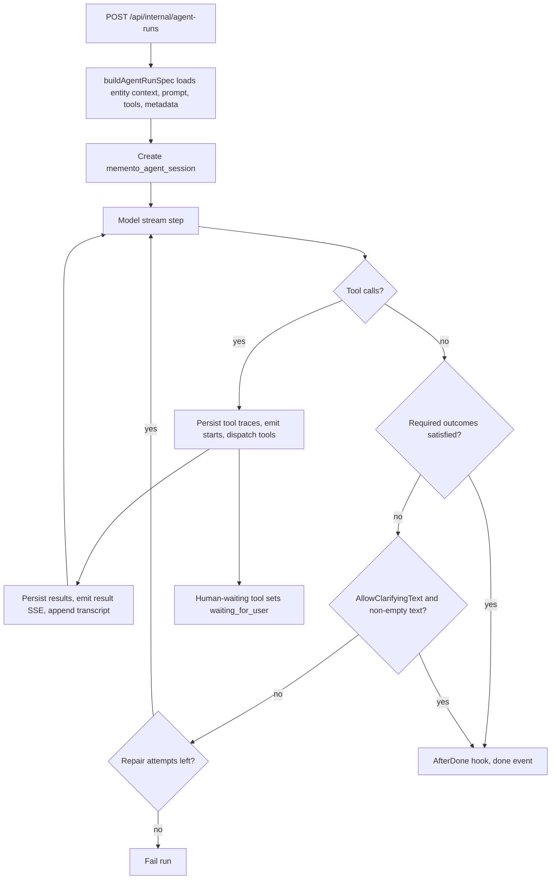

# Agent Loop and Prompt Workflows

Document status: current implementation reference
Last updated: June 2026
Audience: engineers and agents changing Memento agent behavior

This document describes how Memento's Go agent runner executes prompts and what
each current system prompt is trying to make the model do. It is based on the
code in `backend/internal/agentrunner` and `backend/internal/server`, not on
hosted-demo traces.

For the provider/runtime contract, see [`agent-runtime.md`](agent-runtime.md).
For the tool catalog, see [`agent-tools-reference.md`](agent-tools-reference.md).

## Source of Truth

| Concern                                      | Primary file                                     |
|----------------------------------------------|--------------------------------------------------|
| Agent loop, repair turns, outcome validation | `backend/internal/agentrunner/runner.go`         |
| Provider streaming and transcript replay     | `backend/internal/agentrunner/providers.go`      |
| Per-agent `RunSpec` assembly                 | `backend/internal/server/agent_runs.go`          |
| System prompts                               | `backend/internal/server/agent_prompts.go`       |
| Tool registry and lock keys                  | `backend/internal/server/agent_tool_registry.go` |
| Tool schemas                                 | `backend/internal/server/agent_tool_schemas.go`  |
| Direct tool dispatch                         | `backend/internal/server/agent_tool_direct.go`   |

## Execution Loop

Every run is persisted in `memento_agent_session`. The runner then repeats a
bounded model/tool loop until the agent satisfies its completion contract, asks a
permitted clarifying question, waits for a human decision, fails, or hits
`MEMENTO_AGENT_STEP_LIMIT`.

Important mechanics:

- Read-only tools run concurrently within a model-emitted batch, capped by
  `AgentMaxParallelTools`: 8 when `MEMENTO_MSGVAULT_API_URL` is set, otherwise 4.
- Mutating and human-waiting tools serialize by lock key.
- Tool errors, except context cancellation/deadline, become error-shaped tool
  results so the model can recover.
- Required outcomes count only successful, non-skipped tool results.
- Missing required outcomes trigger at most one repair turn for current agents.
- `AllowClarifyingText` is enabled for collector and dashboard runs only.
- Browser disconnects do not cancel runs. Persisted SSE events replay by
  `after_seq` / `Last-Event-ID`.

## Current Agents

| Agent type        | Surface                  | Prompt                       | Completion contract                                                                         |
|-------------------|--------------------------|------------------------------|---------------------------------------------------------------------------------------------|
| `collector`       | Draft curation           | `collectorPrompt(kind)`      | one of `propose_bundle` or `propose_backfill`; clarifying text may close an ambiguous turn  |
| `project_compile` | Project generation       | `projectPrompt(name)`        | `write_section` for `summary`, `phases`, `friction_points`, `current_understanding`         |
| `concept_compile` | Concept generation       | `conceptPrompt(name, scope)` | `write_concept_section` for `scope_summary`, `distilled_insights`, `evolving_understanding` |
| `person_enrich`   | Person memory enrichment | `personPrompt(displayName)`  | at least one `write_facet`, one attribute decision, and missing narrative writes            |
| `dashboard`       | Ask Memento chat         | `mementoPrompt`              | no required writes; clarifying text is allowed                                              |

Newsletter summaries and social group labels are not part of this agent loop.
They use provider-neutral one-shot flows.

## Collector Prompt

Purpose: search the archive for a new project or concept draft, stage a
reviewable bundle, and optionally propose backfill messages when deterministic
gap checks or social graph hints reveal missing evidence.

Tools:

`fts_search`, `vector_search`, `get_message`, `get_message_batch`,
`find_people`, `get_thread`, `summarize_thread`, `propose_bundle`,
`get_person_summary`, `detect_gaps`, `detect_gaps_with_results`,
`context_status`, `propose_backfill`, `find_missing_collaborators`

Workflow:

1. Acknowledge the user's intent briefly.
2. For short ambiguous noun-phrase requests, run a cheap reconnaissance pass:
   2-3 narrow `fts_search` calls with small limits. Do not fetch messages,
   threads, or people during this pass.
3. If reconnaissance results split into distinct events, stop and ask one
   specific clarifying question. This is allowed because collector sets
   `AllowClarifyingText`.
4. If the scope is clear, run deeper search using FTS for keyword/operator
   queries and vector search for semantic recall.
5. Resolve people with `find_people`, then verify resolved people with
   `get_person_summary` before proposing them.
6. Confirm central evidence with `get_message`, `get_message_batch`,
   `get_thread`, or `summarize_thread`.
7. When at least two people are resolved, run `find_missing_collaborators` once.
   Graph weight is not evidence. Any suggested collaborator must be confirmed
   with targeted message search before being proposed.
8. Call `propose_bundle` exactly once when the bundle is coherent.
9. After `propose_bundle`, call `detect_gaps` on bundled message ids. For
   material medium/high gaps, search targeted hints and call `propose_backfill`
   with at most a small set of candidate message ids.
10. Close with a concise statement that the bundle is ready for review, including
    any relevant gap/backfill status.

Current-state notes:

- `propose_backfill` is enabled for collector. It is a human-waiting tool that
  can also satisfy the collector's `collector_close` outcome.
- Missing-collaborator and gap backfills are proposed through
  `propose_backfill`; they are not silently folded directly into the bundle.
- The collector should propose a sparse bundle when evidence is thin but scope is
  clear. It should not ask generic preference questions.

## Project Compile Prompt

Purpose: read a user-confirmed project bundle and write a four-section,
source-attributed narrative for the project page.

Tools:

`get_bundle_index`, `get_message_batch`, `summarize_thread`,
`get_project_bundle`, `get_message`, `fts_search`, `vector_search`,
`write_section`, `get_person_summary`, `detect_gaps`,
`detect_gaps_with_results`, `context_status`, `get_person_network`,
`find_bridges_between`

Workflow:

1. Call `get_bundle_index` first. It is the compact reading plan.
2. Call `context_status` before broad expansion.
3. Prefer targeted `get_message_batch` reads and `summarize_thread` over
   `get_project_bundle`. Use full bundle fetch only when the compact path is
   insufficient and budget allows it.
4. Chase loose ends with targeted FTS/vector search or single-message reads.
5. Use person and social graph tools for participant context, but treat graph
   topology as directional context, not citable evidence.
6. Run `detect_gaps_with_results` in chronological mode when timeline continuity
   matters.
7. Write all four sections, ideally in one model response:
   `summary`, `phases`, `friction_points`, `current_understanding`.

Section expectations:

- `summary`: prose with inline `[msg:id]` citations.
- `phases`: JSON array serialized as a string with
  `title`, `date_range`, `content`, `source_message_ids`.
- `friction_points`: JSON array serialized as a string with
  `text`, `source_message_ids`.
- `current_understanding`: prose with inline citations.

Every `write_section` call must include non-empty `source_message_ids`. Writes
are protected against overwriting user-edited sections.

## Concept Compile Prompt

Purpose: read a user-declared concept bundle and write a thematic knowledge
document. Concepts are not project timelines; they are organized around durable
themes and evolving understanding.

Tools:

`get_bundle_index`, `get_message_batch`, `summarize_thread`,
`get_concept_bundle`, `cluster_messages_by_subject`, `get_message`,
`fts_search`, `vector_search`, `write_concept_section`, `get_person_summary`,
`detect_gaps`, `detect_gaps_with_results`, `context_status`

Workflow:

1. Call `get_bundle_index` first.
2. Call `cluster_messages_by_subject` to get deterministic candidate themes.
3. Call `context_status` before broad expansion.
4. Use `detect_gaps_with_results` in thematic mode when coverage looks thin.
5. Read selectively with `get_message_batch`; use concept bundle fetch only as a
   heavy fallback.
6. Write all three sections:
   `scope_summary`, `distilled_insights`, `evolving_understanding`.

Section expectations:

- `scope_summary`: prose defining the archive-backed scope.
- `distilled_insights`: JSON array serialized as a string with
  `title`, `content`, `source_message_ids`.
- `evolving_understanding`: prose emphasizing how the user's understanding or
  archive evidence changed over time.

Every factual sentence needs citations, and every write needs non-empty
`source_message_ids`.

## Person Enrich Prompt

Purpose: enrich one person page with facets, structured attributes, and
narrative sections while respecting user notes and user-edited memory.

Before the model starts, `buildAgentRunSpec` injects deterministic bootstrap
context into the transcript. The bootstrap includes compact profile details,
authoritative notes, alias/social summaries, recent compact messages, existing
facets, existing attributes, existing narrative, generation mode, and a cleanup
cutoff.

Tools:

`list_person_messages`, `fts_search_scoped`, `get_message`,
`get_message_batch`, `write_facet`, `write_person_attribute`,
`record_no_person_attributes`, `write_person_section`, `get_person_network`,
`get_group`, `get_cluster`, `context_status`

Workflow:

1. Read the bootstrap first. Existing memory and cited message ids in the
   bootstrap may be reused without re-fetching.
2. Do not call `get_person_summary`; it is intentionally unavailable because the
   bootstrap carries that signal.
3. Avoid `list_person_messages` unless the bootstrap recent messages are
   insufficient for a specific missing time range.
4. Call `context_status` before scoped expansion.
5. Use at most a small number of narrow `fts_search_scoped` calls, only for
   specific missing or contradictory details.
6. Write 4-12 concrete, cited facets when evidence supports them.
7. Decide structured attributes:
   call `write_person_attribute` for strong, message-backed right-rail details,
   or `record_no_person_attributes` when no strong attribute evidence exists.
8. Write narrative sections that need updates. Existing bootstrap narrative
   sections are not required outcomes; user-edited sections are protected by the
   write tools.
9. End after writes with a brief chat summary. Do not re-read just to verify.

Completion details:

- The run still requires at least one successful `write_facet`.
- The run requires either `write_person_attribute` or
  `record_no_person_attributes`.
- Narrative section requirements are dropped when that section already exists in
  bootstrap, whether user-edited or LLM-generated.
- `AfterDone` fails the run if no LLM output was written, then cleans up
  superseded LLM facets/attributes using the bootstrap cutoff and refreshes the
  person report.

## Dashboard Prompt

Purpose: answer freeform questions, retrieve entity summaries into the side
panel, and create draft staging areas for projects or concepts.

Tools:

`fts_search`, `vector_search`, `get_message_batch`, `summarize_thread`,
`search_persons`, `search_projects`, `search_concepts`,
`get_person_summary`, `get_project_summary`, `get_concept_summary`,
`create_project_draft`, `create_concept_draft`, `detect_gaps`,
`detect_gaps_with_results`, `context_status`, `get_person_network`,
`find_bridges_between`

Workflow guide:

- Known entity request: search the relevant dimension, then call the matching
  summary tool. Summary calls also populate the dashboard side panel.
- Raw archive question: use FTS for keywords/operators, vector search for
  semantic recall, then compact message reads.
- Small or lopsided result sets: call `detect_gaps_with_results` before
  answering.
- Follow-up on cited evidence: fetch already-cited message ids directly instead
  of re-searching.
- Project/concept creation request: gather support message ids, call
  `create_project_draft` or `create_concept_draft`, and return the URL.

Dashboard has no required write outcome and may end with a clarifying question.
It should not call `propose_backfill`; it does not mutate existing bundles.

## Debugging the Loop

Useful tables:

| Table                     | What to inspect                                                           |
|---------------------------|---------------------------------------------------------------------------|
| `memento_agent_session`   | run type, status, model, token totals, error message                      |
| `memento_agent_loop`      | per-step input, assistant text, reasoning text, tool calls/results, usage |
| `memento_agent_tool_call` | per-tool args, result, duration, lock key, error                          |
| `memento_agent_event`     | persisted SSE stream replayed to the browser                              |
| `memento_agent_decision`  | human-waiting backfill decisions                                          |

The `/debug` page shows run traces. Expanded read-only tool trace cards include
a "Replay in tool console" link to `/debug/tools` when the tool is safe to
invoke outside a live run.

Common failure modes:

- **Missing required outcomes:** the model ended without required write tools and
  the repair turn did not fix it.
- **Skipped writes:** a write returned `skipped=true`, usually because a
  user-edited section is protected. Skipped writes do not satisfy required
  outcomes.
- **Context pressure:** `context_status` reports `watch`, `low`, or `critical`;
  agents should switch to compact tools or write from current evidence.
- **Human wait:** `propose_backfill` sets the run to `waiting_for_user` until
  the UI accepts, skips, or times out the decision.
