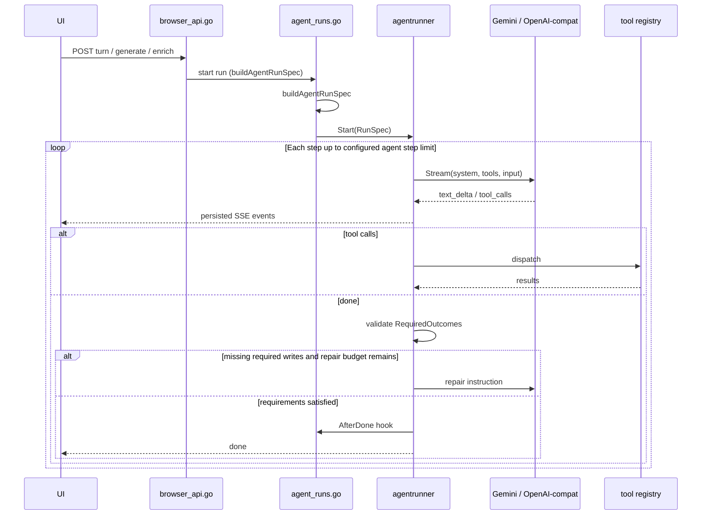

# Memento Agent Runtime

Document status: authoritative reference for the Go agent loop
Last updated: June 4, 2026
Audience: engineers and agents changing prompts, tools, or run behavior

For product rules and invariants, read [`AGENTS.md`](../AGENTS.md) first. For stack, schema, and HTTP surfaces, see [
`spec-current-state.md`](spec-current-state.md).

## Overview

All five generative agents run in Go (`backend/internal/agentrunner`). The
browser calls the Go server directly on the same origin; there is no Next.js
proxy. The agent loop is hosted entirely in Go.

**Not part of this runtime:** newsletter summary generation and social label one-shots use provider-neutral
`backend/internal/llm.OneShot` directly.

## Key files

| File                                             | Role                                                         |
|--------------------------------------------------|--------------------------------------------------------------|
| `backend/internal/agentrunner/runner.go`         | Step loop, tool dispatch, SSE emit, usage logging            |
| `backend/internal/agentrunner/providers.go`      | Gemini Interactions API + OpenAI-compatible streaming        |
| `backend/internal/server/agent_runs.go`          | Per-agent `RunSpec` assembly, HTTP run/event/cancel handlers |
| `backend/internal/server/agent_prompts.go`       | System prompts for all five loop agents                      |
| `backend/internal/server/agent_tool_registry.go` | Tool handlers, locking, human-waiting tools                  |
| `backend/internal/server/agent_tool_schemas.go`  | JSON schemas exposed to the model                            |
| `backend/internal/server/agent_tool_direct.go`   | Direct dispatch from registry to existing tool logic         |
| `backend/internal/server/browser_api.go`         | Browser-facing start+stream routes (generate/turn/enrich)    |
| `src/lib/agent-events.ts`                        | Frontend `AgentEvent` contract + SSE consumption             |

## Loop behavior

1. The browser-facing route (`browser_api.go`) assembles a run with `agent_type`, `entity_id`, optional `user_message`,
   `previous_interaction_id`, and `request_metadata` (equivalently `POST /api/internal/agent-runs` for tooling).
2. `buildAgentRunSpec` loads entity context from SQLite, sets `System`, `Tools`, `InitialTranscript`, and `AfterDone`.
3. The runner persists the run in `memento_agent_*` tables and streams model output.
4. Each step: provider streams text; tool calls are collected; read-only tools may run in parallel (max 4 or 8 depending
   on the msgvault backend); mutating and human-waiting tools serialize via lock keys.
5. When the model returns no tool calls, the runner first validates `RequiredOutcomes` from the `RunSpec`. These are
   successful persisted tool calls such as `write_section(section="summary")`.
6. If required outcomes are missing, the runner emits `requirements_status` and performs at most `MaxRepairAttempts`
   repair turns. The default is one repair attempt when requirements exist. The repair prompt tells the model to call
   only the missing write/update tools, using already-loaded evidence when possible.
7. If requirements are still missing after the repair budget is exhausted, the run fails and no `done` event is emitted.
   This prevents infinite recovery loops.
8. Once requirements are satisfied, `AfterDone` runs (rollup refresh, draft transcript append, output validation), then
   Go emits `done`.
9. Exceeding the configured agent step limit fails the run. The current code reads `MEMENTO_AGENT_STEP_LIMIT` and
   defaults to `20`.

**Context persistence**

- **Gemini:** conversation state is server-side via `interaction_id` on the Interactions API.
- **OpenAI-compatible:** the runner replays a local transcript (`InitialTranscript` plus per-step append).

**Durability:** browser disconnect does not cancel a run. Events replay from
`GET /api/internal/agent-runs/{id}/events` (`after_seq` / `Last-Event-ID`).

## Prompts

System prompts live in one file: `backend/internal/server/agent_prompts.go`.

| Agent            | Prompt builder               | Wired in `buildAgentRunSpec`      |
|------------------|------------------------------|-----------------------------------|
| Collector        | `collectorPrompt(kind)`      | draft `kind` from `memento_draft` |
| Project compile  | `projectPrompt(name)`        | project name                      |
| Concept compile  | `conceptPrompt(name, scope)` | concept name + scope              |
| Person enrich    | `personPrompt(displayName)`  | canonical name or email           |
| Dashboard router | `mementoPrompt` (const)      | —                                 |

Default kickoff user messages (when the client sends an empty message) are inline templates in `agent_runs.go`. Tool
names also appear narratively inside each system prompt; keep prompt text and `spec.Tools` lists aligned when adding
tools.

## Environment

| Variable                               | Default                 | Purpose                                                                                                                                                                                                                                           |
|----------------------------------------|-------------------------|---------------------------------------------------------------------------------------------------------------------------------------------------------------------------------------------------------------------------------------------------|
| `MEMENTO_MODEL_PROVIDER`               | `gemini`                | `gemini`, `openai_compatible`, or `fake` (tests)                                                                                                                                                                                                  |
| `MEMENTO_AGENT_MODEL`                  | `gemini-3.5-flash`      | Default model                                                                                                                                                                                                                                     |
| `MEMENTO_<NAME>_MODEL`                 | —                       | Per-agent override (`COLLECTOR`, `PROJECT`, `CONCEPT`, `PERSON`, `MEMENTO`)                                                                                                                                                                       |
| `MEMENTO_MODEL_API_KEY`                | —                       | API key for the configured model provider                                                                                                                                                                                                         |
| `MEMENTO_MODEL_BASE_URL`               | —                       | Optional Gemini endpoint override, or required OpenAI-compatible base URL                                                                                                                                                                         |
| `MEMENTO_MODEL_THINKING`               | —                       | Optional DeepSeek V4 thinking toggle (`enabled`/`disabled`; also accepts `on`/`off`, `true`/`false`, `1`/`0`)                                                                                                                                     |
| `MEMENTO_MODEL_REASONING_EFFORT`       | —                       | Optional reasoning effort. OpenAI `api.openai.com` uses Responses API `reasoning.effort`; DeepSeek V4 Chat Completions sends `reasoning_effort` (`low`/`medium`/`high` -> `high`, `xhigh`/`max` -> `max`). Generic compatible gateways ignore it. |
| `MEMENTO_MODEL_REPLAY_REASONING`       | off                     | Replays assistant `reasoning_content` for providers that require it                                                                                                                                                                               |
| `MEMENTO_AGENT_STEP_LIMIT`             | `20`                    | Max model steps per run                                                                                                                                                                                                                           |
| `MEMENTO_AGENT_STALE_AFTER_MS`         | `120000`                | Stale non-terminal runs marked failed by the background sweep                                                                                                                                                                                     |
| `MEMENTO_AGENT_DECISION_TIMEOUT_MS`    | `90000`                 | Human backfill decision timeout                                                                                                                                                                                                                   |
| `MEMENTO_AGENT_CONTEXT_LIMIT_TOKENS`   | `128000`                | Context budget denominator reported by `context_status`                                                                                                                                                                                           |
| `MEMENTO_AGENT_VERBOSE_LOGS`           | off                     | Extra provider request logs plus raw Gemini/OpenAI-compatible SSE lines                                                                                                                                                                           |
| `MEMENTO_AGENT_SIMULATION`             | off                     | Simulated SSE for project/concept/person routes (no LLM)                                                                                                                                                                                          |
| `MEMENTO_AGENT_SIMULATION_DELAY_MS`    | `220`                   | Default pacing for simulated SSE events                                                                                                                                                                                                           |
| `NEXT_PUBLIC_MEMENTO_AGENT_SIMULATION` | off                     | Shows simulation controls in browser UI                                                                                                                                                                                                           |
| `MEMENTO_INTERNAL_TOKEN`               | —                       | Gates `/api/internal/*` tooling endpoints; not required for normal browser UI                                                                                                                                                                     |
| `MEMENTO_BACKEND_URL`                  | `http://127.0.0.1:8787` | Target of the `next dev` `/api/*` proxy (frontend development only)                                                                                                                                                                               |

## Human-in-the-loop

`propose_backfill` is `ToolHumanWaiting`. It emits a `proposed_backfill` SSE event, sets run status to
`waiting_for_user`, polls `memento_agent_decision` until the user resolves or timeout, then resumes the loop. Collector
UI posts decisions to `POST /api/drafts/[id]/backfill`.

## Implemented agents

Browser-facing route (`backend/internal/server/browser_api.go`) → Go `agent_type` → entity ID:

| Surface         | Go route                             | `agent_type`      | `entity_id`   |
|-----------------|--------------------------------------|-------------------|---------------|
| Dashboard chat  | `POST /api/agents/memento/turn`      | `dashboard`       | `"dashboard"` |
| Draft curation  | `POST /api/drafts/{id}/turn`         | `collector`       | draft ID      |
| Project compile | `POST /api/projects/{slug}/generate` | `project_compile` | project slug  |
| Concept compile | `POST /api/concepts/{slug}/generate` | `concept_compile` | concept slug  |
| Person enrich   | `POST /api/people/{slug}/enrich`     | `person_enrich`   | person slug   |

These browser routes start a run and stream its SSE in one response. The
token-gated lifecycle endpoints (`POST /api/internal/agent-runs`,
`GET /api/internal/agent-runs/{id}/events`, `POST /api/internal/agent-runs/{id}/cancel`)
remain for tooling and tests.

### Dashboard router (`dashboard`)

Purpose: answer freeform questions, load entity summaries into the side panel, create project/concept drafts.

Tools (from `agent_runs.go`): `fts_search`, `vector_search`, `get_message_batch`, `summarize_thread`, `search_persons`,
`search_projects`, `search_concepts`, `get_person_summary`, `get_project_summary`, `get_concept_summary`,
`create_project_draft`, `create_concept_draft`, `detect_gaps`, `detect_gaps_with_results`, `context_status`,
`get_person_network`, `find_bridges_between`.

Requires `user_message`. Prior chat turns arrive in `request_metadata.history` (last 20 user/assistant lines).

### Collector (`collector`)

Purpose: search the archive, stage an `EntityBundle`, run gap/backfill flows during curation.

Tools: `fts_search`, `vector_search`, `get_message`, `get_message_batch`, `find_people`, `get_thread`,
`summarize_thread`, `propose_bundle`, `get_person_summary`, `detect_gaps`, `detect_gaps_with_results`, `context_status`,
`propose_backfill`, `find_missing_collaborators`.

Persistence after success:

- `interaction_id` on `memento_draft`
- user/assistant lines appended to `memento_draft.transcript_json`
- bundle in `memento_draft.entities_json`

Lock key: `draft:{id}` for mutating tools.

Completion contract: at least one `collector_close` outcome must succeed:
`propose_bundle` for normal curation, or `propose_backfill` for backfill
decision turns. The runner gets one repair attempt before failing the run.

### Project compile (`project_compile`)

Purpose: write four narrative sections with source attribution.

Tools: `get_bundle_index`, `get_message_batch`, `summarize_thread`, `get_project_bundle`, `get_message`, `fts_search`,
`vector_search`, `write_section`, `get_person_summary`, `detect_gaps`, `detect_gaps_with_results`, `context_status`,
`get_person_network`, `find_bridges_between`.

Write order: `summary` → `phases` → `friction_points` → `current_understanding`.  
`phases` and `friction_points` content must be JSON-array strings with the field shapes defined in the project prompt.

After-done: `refresh.RefreshProjectsReport`.

Completion contract: the runner requires successful `write_section` calls for
`summary`, `phases`, `friction_points`, and `current_understanding`. Missing
sections trigger one bounded repair turn before failure.

### Concept compile (`concept_compile`)

Purpose: thematic concept narrative (not a project timeline).

Tools: `get_bundle_index`, `get_message_batch`, `summarize_thread`, `get_concept_bundle`, `cluster_messages_by_subject`,
`get_message`, `fts_search`, `vector_search`, `write_concept_section`, `get_person_summary`, `detect_gaps`,
`detect_gaps_with_results`, `context_status`.

Write order: `scope_summary` → `distilled_insights` → `evolving_understanding`.

After-done: `refresh.RefreshConceptsReport`.

Completion contract: the runner requires successful `write_concept_section`
calls for `scope_summary`, `distilled_insights`, and
`evolving_understanding`. Missing sections trigger one bounded repair turn
before failure.

### Person enrich (`person_enrich`)

Purpose: relationship wiki structured attributes, facets, and narrative sections; user notes are authoritative.

Pre-run: builds deterministic bootstrap context before the model starts. The bootstrap includes compact person summary,
authoritative notes, alias/social-graph summaries, recent compact messages, existing facets, existing structured
attributes, and existing narrative. It is persisted in `memento_agent_session.request_metadata_json` under
`person_enrich_bootstrap` for later debug analysis.

Tools: `list_person_messages`, `fts_search_scoped`, `get_message`, `get_message_batch`, `write_facet`,
`write_person_attribute`, `record_no_person_attributes`, `write_person_section`, `get_person_network`, `get_group`,
`get_cluster`, `context_status`.

Concurrent runs: starting a second `person_enrich` for the same person slug while another run is `queued`, `running`, or
`waiting_for_user` returns HTTP 409 with `active_run_id`. This prevents overlapping bootstrap/cleanup windows for the
same contact.

Facet types: `interest`, `life_event`, `recurring_topic`, `relationship_signal`, `fact`.  
Attribute categories: `vital_date`, `preference`, `interest`, `relationship_marker`, `household`, `work`, `location`,
`routine`, `identifier`.
Narrative order: `summary` → `relationship_arc` → `current_status`.

After-done: fails if no LLM output was written. On success, old LLM facets are deleted only after at least one new facet
is available. Old LLM structured attributes are deleted only after at least one new attribute is available. Superseded
LLM rows must also have `generated_at <= person_enrich_replacement_cutoff` from the run bootstrap. User-edited rows are
preserved. Narrative sections use protected upserts, so user-edited sections are not overwritten; the model should skip
calling `write_person_section` for those sections, and skipped writes do not satisfy required outcomes. Finally,
`refresh.RefreshPeopleReportForPerson` runs.

Completion contract: the runner requires at least one successful `write_facet`,
either `write_person_attribute` or `record_no_person_attributes` (exactly one
attribute-decision path per run), and successful `write_person_section` calls for
each narrative section that is not user-edited in bootstrap. Missing outputs
trigger one bounded repair turn before failure.

## Lock model

- Collector mutating tools: `draft:{id}`
- `propose_backfill`: `decision:{agent_type}:{entity_id}`
- Other mutating tools: `{agent_type}:{entity_id}`

## Internal tool HTTP surface

Legacy `/api/internal/agent-tools/*` HTTP handlers still exist for direct invocation and debugging. The Go runner
normally calls the same logic through `callAgentToolDirect` without an HTTP round trip.

See [`spec-current-state.md` §14.2](spec-current-state.md) for the endpoint list.

## Related docs

- [`agent-context-management.md`](agent-context-management.md) — context pressure analysis, mitigation catalog, open
  work
- [`deterministic-extraction.md`](deterministic-extraction.md) — what stays deterministic vs LLM-driven
